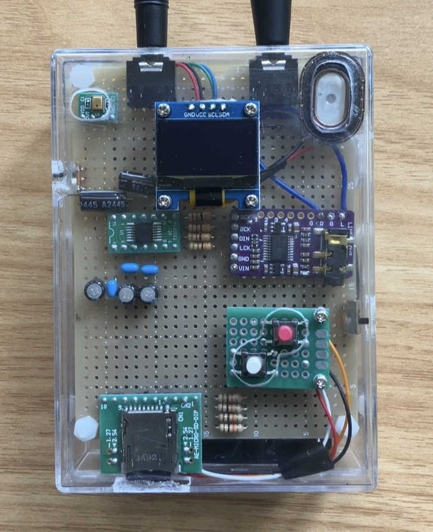

# esp32_recorder

## Overview
This is an example of a recorder using esp32.  


## Parts List
Only the main parts are described below. 
- (microcomputer): [ESP32-DevKitC ESP32-WROVER-E](https://www.espressif.com/en/products/devkits/esp32-devkitc/overview)
- (ADC): [PCM1808](https://www.ti.com/product/ja-jp/PCM1808?utm_source=google&utm_medium=cpc&utm_campaign=asc-null-null-44700045336317836_prodfolderdynamic-cpc-pf-google-jp_jp_int&utm_content=prodfolddynamic&ds_k=DYNAMIC+SEARCH+ADS&DCM=yes&gad_source=1&gclid=Cj0KCQjw782_BhDjARIsABTv_JCKzPZbY6ozSfQwp9jb3ZqJce7yC91za8KWuVxvTnxS05SAo-_v95oaAldwEALw_wcB&gclsrc=aw.ds)
- (DAC): [PCM5102A](https://www.ti.com/product/ja-jp/PCM5102A?utm_source=google&utm_medium=cpc&utm_campaign=asc-null-null-44700045336317836_prodfolderdynamic-cpc-pf-google-jp_jp_int&utm_content=prodfolddynamic&ds_k=DYNAMIC+SEARCH+ADS&DCM=yes&gad_source=1&gclid=Cj0KCQjw782_BhDjARIsABTv_JAAWjEvNnrAvuU2UDLl-zNntTw5vr8SZ7dBENhgkRaESFXAj_G9O90aAswvEALw_wcB&gclsrc=aw.ds) (I purchased the module board from Amazon and used it.)
- (SD slot): [AE-MICRO-SD-DIP](https://akizukidenshi.com/catalog/g/g105488/)
- (display): [OLED display module(SSD1306)](https://akizukidenshi.com/catalog/g/g112031/)

## Pin connections
Pin connections are as follows:
```c
/* pin configuration */
// VSPI pin
#define VSPI_SCK               GPIO_NUM_18
#define VSPI_MOSI              GPIO_NUM_21         // default -> GPIO23
#define VSPI_MISO              GPIO_NUM_19
#define VSPI_CS                GPIO_NUM_5

// I2S pin
#define I2S_STD_MCLK           GPIO_NUM_0          // I2S master clock io number
#define I2S_STD_BCLK           GPIO_NUM_33         // I2S bit clock io number
#define I2S_STD_WS             GPIO_NUM_32         // I2S word select io number
#define I2S_STD_DOUT           GPIO_NUM_25         // I2S data out io number
#define I2S_STD_DIN            GPIO_NUM_26         // I2S data in io number

// I2C pin
#define OLED_SDA               GPIO_NUM_22         // default -> GPIO21
#define OLED_SCL               GPIO_NUM_23         // default -> GPIO22

// Button pin
#define BTN_REC_PLAY           GPIO_NUM_34         // rec/play Button(3.3V, pulldown)
#define BTN_MODE               GPIO_NUM_35         // mode Button(3.3V, pulldown)
```
## References
- espressif "esp-idf i2s examples": https://github.com/espressif/esp-idf/tree/v5.4.1/examples/peripherals/i2s
- atomic14 "ESP32 SDCard Wave File Example": https://github.com/atomic14/esp32_sdcard_audio  
- uebo Tj Lab "ESP32-S3 AF信号処理ボード":  
https://tj-lab.org/2022/10/05/esp32-s3-af%e4%bf%a1%e5%8f%b7%e5%87%a6%e7%90%86%e3%83%9c%e3%83%bc%e3%83%89/  
- Lang-ship "ESP32のFreeRTOS入門シリーズ": https://lang-ship.com/blog/work/esp32-freertos-l01-about/
- AUTODESK Instructables "How to Display Images on OLED Using Arduino":  
  https://www.instructables.com/How-to-Display-Images-on-OLED-Using-Arduino/
- Prototype0.9 "SDカード速度比較(ESP32 vs Teensy4.1 x SD vs SDFAT vs SDMMC ライブラリ)":  
  https://prototype09.com/archives/637#toc12
